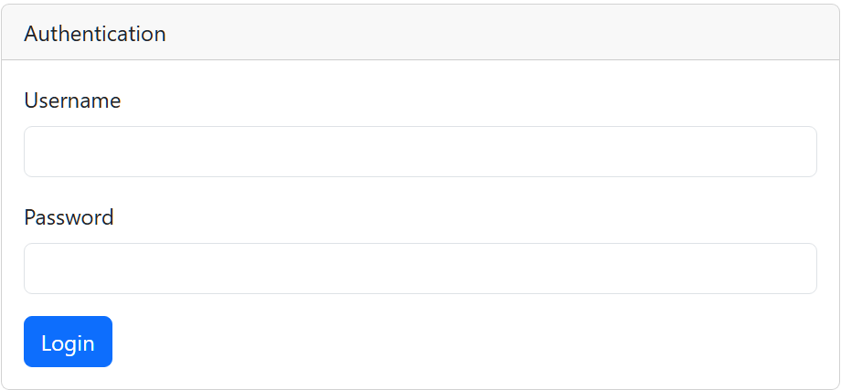
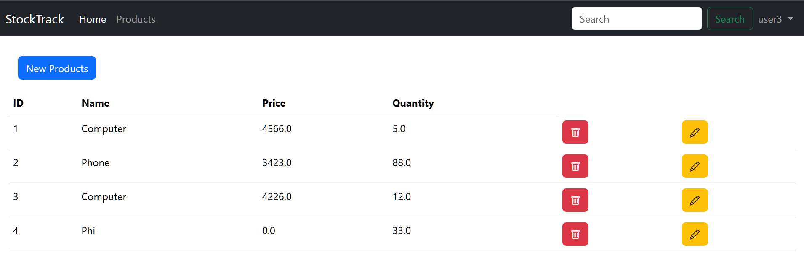
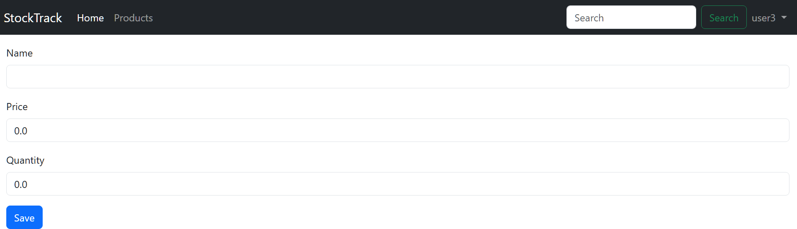
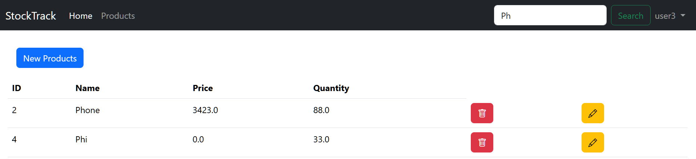

# 🛒 Product-Spring-MVC - Product Management Web App

A complete **Spring Boot MVC** application that allows users to **manage products** securely with **authentication**, using **Spring Boot**, **Spring Security**, **Thymeleaf**, and **Spring Data JPA** for database interactions.

---

## 🔧 Features

- ✅ User login with Spring Security
- 📋 View list of all products
- ➕ Add a new product (secured)
- 🔒 Access control with role-based authorization
- 🖼️ Responsive web UI using Thymeleaf templates
- 💾 Persistent data storage via JPA (H2/MySQL/PostgreSQL adaptable)

---

## 🧠 Application Architecture


## 🛠️ Tech Stack

- Java 17+
- Spring Boot
- Spring MVC
- Spring Data JPA
- Spring Security
- Thymeleaf
- Maven

## 📁 Project Structure

```
product-spring-mcv/
│
├── .idea/
├── .mvn/
│
├── src/
│   ├── main/
│   │   ├── java/
│   │   │   └── ma.youhad.productspringmcv/
│   │   │       ├── entities/
│   │   │       │   ├── Product.java
│   │   │       │   └── ...
│   │   │       ├── repository/
│   │   │       │   ├── ProductRepository.java
│   │   │       │   └── ...
│   │   │       ├── security/
│   │   │       │   ├── SecurityConfig.java
│   │   │       │   └── ...
│   │   │       ├── web/
│   │   │       │   ├── ProductController.java
│   │   │       │   ├── ProductSpringMcvApplication.java
│   │   │       │   └── ...
│   │   │
│   │   └── resources/
│   │       ├── static/
│   │       └── templates/
│   │           ├── layout1.html
│   │           ├── login.html
│   │           ├── new-product.html
│   │           ├── notAuthorized.html
│   │           └── products.html
│   │
│   └── test/
│
├── application.properties
├── target/
├── .gitattributes
├── .gitignore
├── HELP.md
├── mvnw
├── mvnw.cmd
├── pom.xml
└── README.md
```

## 📸 UI Preview

### 🔐 Login Page


### 🛍️ Products List


### ➕ Add / Update Product Page


### 🔍 Product Search Feature 


## ⚙️ Configuration (`application.properties`)

```properties
spring.datasource.url=jdbc:h2:mem:testdb
spring.datasource.driverClassName=org.h2.Driver
spring.datasource.username=sa
spring.datasource.password=
spring.h2.console.enabled=true
spring.jpa.show-sql=true
spring.jpa.hibernate.ddl-auto=update  
```

## 🔐 Security Overview

- Spring Security is configured in SecurityConfig.java 
- Basic login authentication 
- Only authenticated users (ADMIN) can access protected routes like adding products 
- Default user/password can be customized in config or initialized in code

## 📦 Dependencies (from pom.xml)

- Spring Boot Starter Web
- Spring Boot Starter Thymeleaf 
- Spring Boot Starter Data JPA 
- Spring Boot Starter Security 
- H2 Database (can be replaced with MySQL/PostgreSQL)
- Spring Boot DevTools

## 🔌 Endpoints

| URL              | Description                      | Access        |
| ---------------- | -------------------------------- | ------------- |
| `/login`         | Login page                       | Public        |
| `/products`      | View product list                | Authenticated |
| `/products/new`  | Add new product                  | Authenticated |
| `/notAuthorized` | Shown when user lacks permission | Authenticated |

## ✅ Future Improvements 

- Add user registration and roles (admin/user)
- Upload product images 
- Improve UI with Bootstrap 
- Add pagination/search features 
- Deploy to cloud (Heroku, AWS, etc.)

**Author**: YOUHAD AYOUB